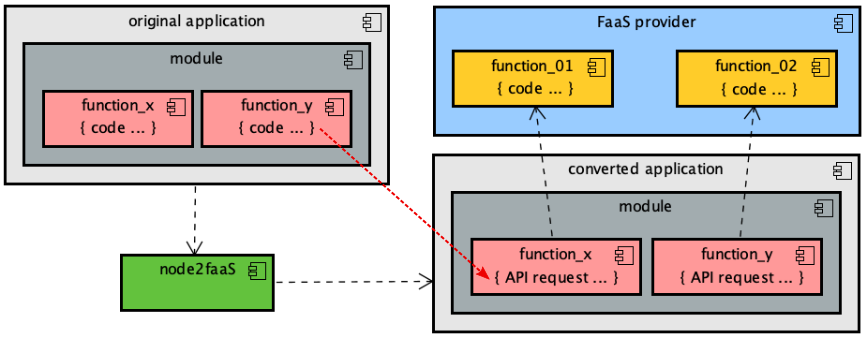

# Node2FaaS Framework

### Node Applications conversor to Function as a Service (FaaS) Deployments.

## Pre-Requisites

To use this conversor you need to have an active account in some FaaS provider like Amazon AWS Lambda.

## Proposite

This framework intend to help NodeJS developers to migrate from monolith model to function as a service (serverless) model. It parses the original code looking for exported functions and create a equivalent function on the provider. Instead of the original function is placed a restAPI request to FaaS. 

## Workflow




## Installation

```npm install node2faas```

or

```git clone https://github.com/leonardoreboucas/node2faas.git```
```cd node2faas```
```npm link```

## Usage

- Anotate any function to be skipped in original with **@node2faas-skip** imediately before function definition

- Run: ```node2faas [/path/to/original/application]```

- Folow de app instructions

- After proccess, check the directory *output*, your application converted to work with FaaS will be there.

## Limitations

- Providers:
	- AWS Lambda (OK)
	- *Microsoft Azure (under construction)*
	- *Google Functions (under construction)*
- Function types:
	- exported (OK)
		- Ex: ```exports.functionName = function(params) { ... } ``` 
	- *local (under construction)* 
		- Ex: ```functionName(params) { ... } ``` 
