### Node Applications conversor to Function as a Service (FaaS) Deployments.

[Hot Page](https://node2faas.faasification.com/)

## Versions

  - 0.1.1 - 2020,Nov
    1. Minor bug corrections;
    1. Graphics on avaluations;
    1. Readme Update
  - 0.1.0 - 2019,Dec
    1. Add multicloud orchestrator (Terraform) with support to AWS, GCP and Azure FaaS services;
    1. Function pre-analysis;
  - 0.0.1 - 2018,Dec
    1. Initial Release

## Purpose

This framework intend to help NodeJS developers to migrate from monolith model to function as a service (serverless) model. It parses the original code looking for exported functions and creates an equivalent function on the provider. Instead of the original function is placed a restAPI request to FaaS.

## Pre-Requisites

To use this conversor you need to have an active account in one of this FaaS services:
 - Amazon AWS Lambda;
 - Google Functions;
 - Microsoft Azure Functions.

### Get credentials parameters on AWS
 * Log in to your AWS Management Console.
 * Click on your user name at the top right of the page.
 * Click on the Security Credentials link from the drop-down menu.
 * Find the Access Credentials section, and copy the latest Access Key ID.
 * Click on the Show link in the same row, and copy the Secret Access Key.

 You should obtain this parameters:
 * access_key_id
 * secret_access_key

### Get credentials parameters on Azure

 You should obtain this parameters:
 * subscription_id
 * azure_tenant_id
 * azure_client_id
 * azure_client_secret

 Follow this instructions: [click](https://www.inkoop.io/blog/how-to-get-azure-api-credentials/)

### Get credentials parameters on GCP

 * Create a service account and set permissions to operate the Compute Engine and VPC Networks.

 You should obtain a JSON file with this parameters:
 * client_x509_cert_url
 * client_email
 * client_id
 * project_id
 * private_key_id
 * zone

The JSON file location will be prompted by the framework during its process.

## Workflow


## Conversion Process

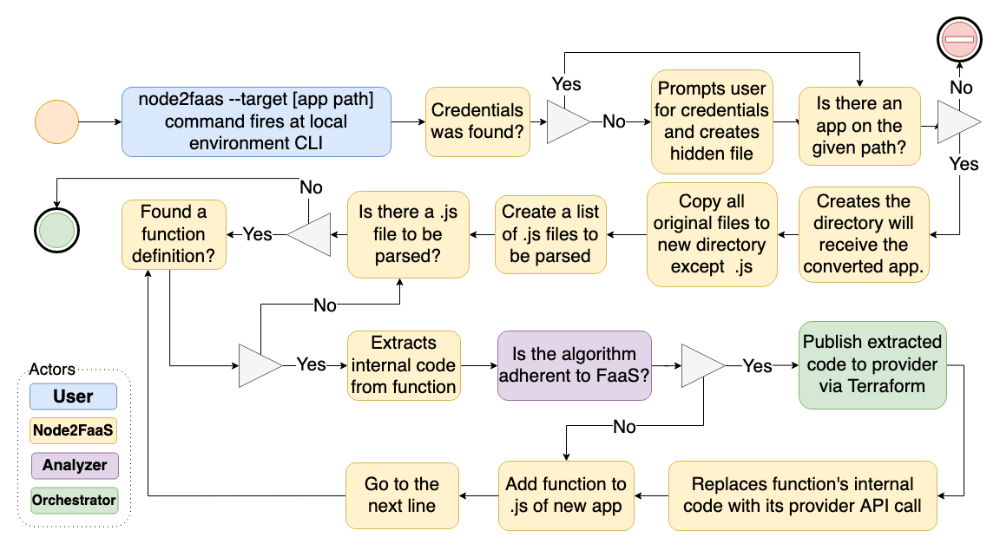

## Framework Composition

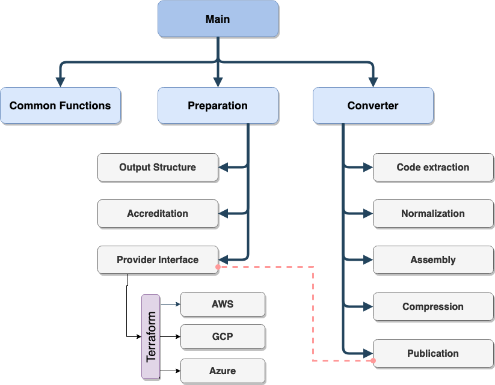


## Installation

```npm install node2faas```

or

```git clone https://github.com/node2faas/framework.git```

```cd node2faas```

```npm link```

## Usage

- Run: ```node2faas --help``` on your terminal to get the CLI Instructions

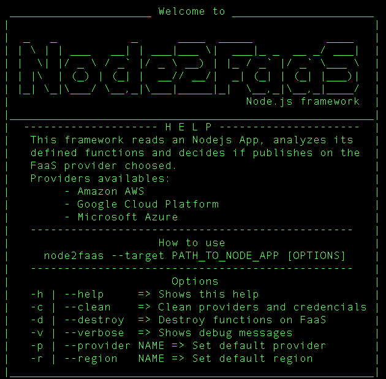


- Run: ```node2faas --target [/path/to/original/application]```

- Follow de conversor instructions

- After proccess, check the directory *output* and your application converted to operate with FaaS should be there.

## Features

- Convert only .js files (other file types are skipped)
- Stores provider credentials after first execution (don't ask again)
- Creates new FaaS function on the choose provider
- Creates all provider API Gateway resources

## Limitations

The framework is prepared to work only with:

- Providers:
	- AWS Lambda
	- GCP Functions
	- Azure Functions
- Function types:
	- exported
		- Ex: ```exports.functionName = function(params) { ... } ```

## Examples

This project contains some examples to guide you. Look inside examples folder.

#### Overload example

- available in path: examples/mocked/bounds

The load example explores 3 potential function loads:
 - Memory -> process with high memory consumption
 - CPU -> process with high CPU consumption
 - I/O -> process with high I/O consumption

## Evaluations

### Tests without orchestrator

- 1 to 100 concurrent requests to each service (traditional and converted)
- Simple Test (simple math operations)
- CPU stress Test (multiple cycles of simple operations)
- Memory stress Test (multiple cycles of writing on memory operations)
- I/O stress Test (multiple cycles of writing on disk operations)
- All data generated in this evaluation is available in path: evaluations/preliminary/outputs
- Files generated have this structure: [initial timestamp in nanoseconds],[final timestamp in nanoseconds],[duration in nanoseconds],[output from service]

### Test Architecture

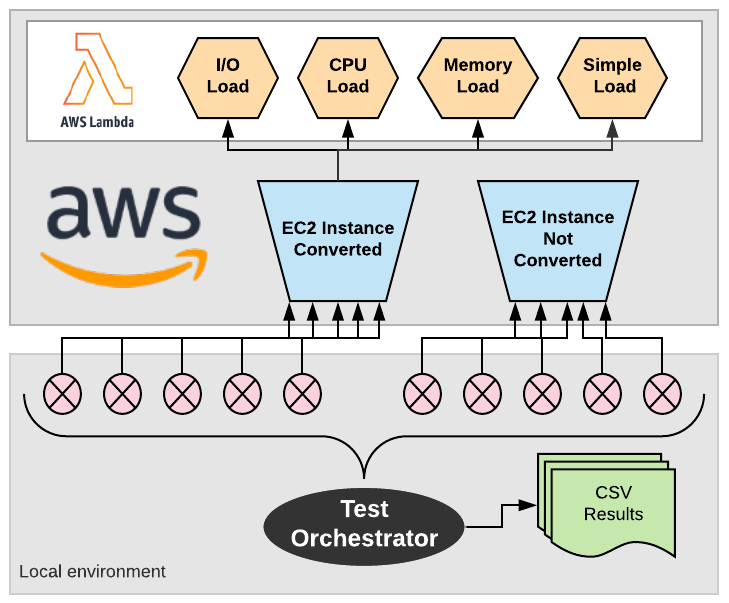

### Results of Simple Test
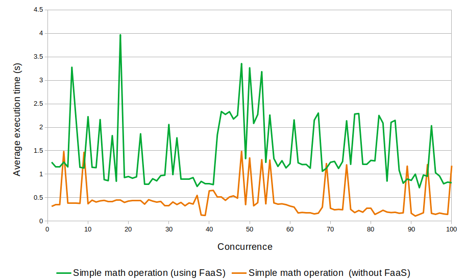

### Results of CPU Stress Test
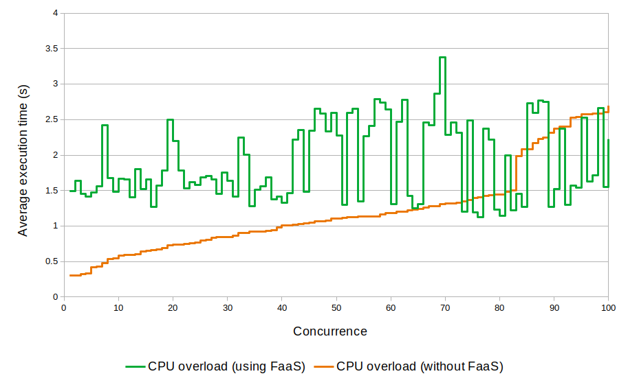

### Results of Memory Stress Test
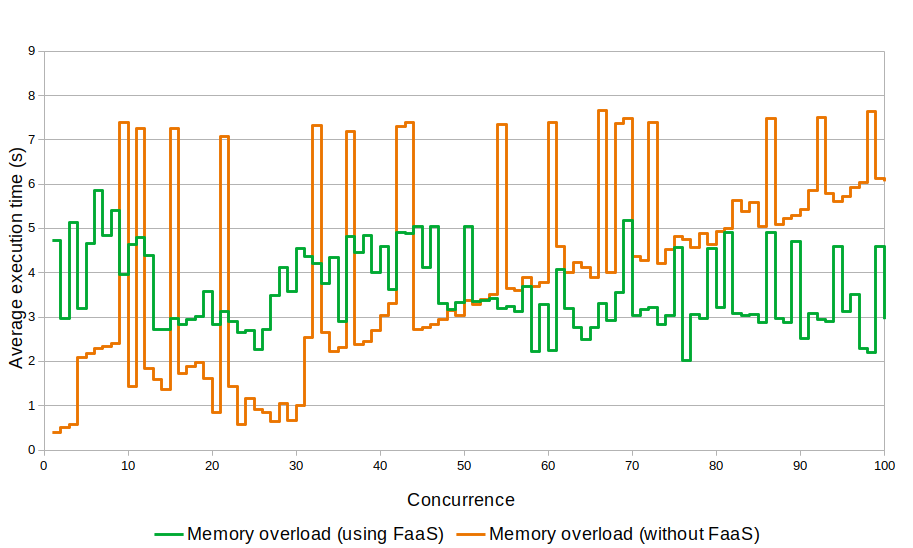

### Results of Memory I/O Test
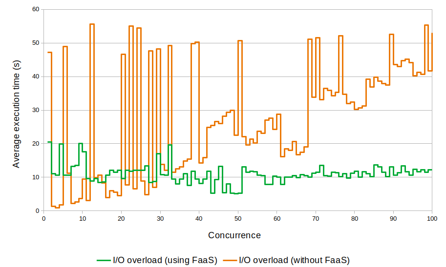


### Tests with Terraform as orchestrator

- CPU stress Test (multiple cycles of simple operations)
- Memory stress Test (multiple cycles of writing on memory operations)
- I/O stress Test (multiple cycles of writing on disk operations)

#### Parameters
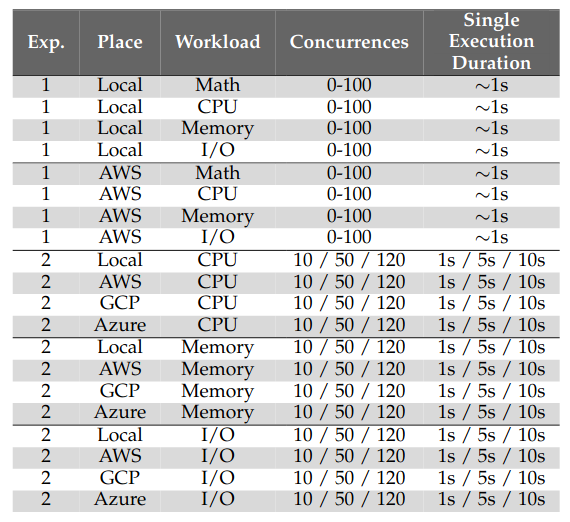

- All data generated in this evaluation is available in path: evaluations/conclusive/results

- A list of test case was generated using the parameters. This table is available in file: evaluation/conclusive/test_cases.csv

- Files generated have this structure: [id test case],[sequence],[test output],[duration in nanoseconds]

### Results of CPU Bound Test
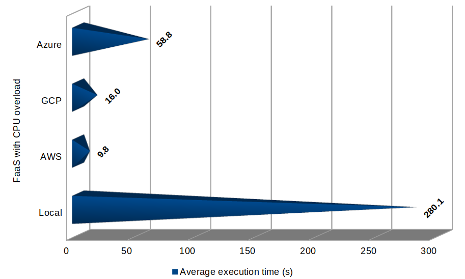

### Results of Memory Bound Test
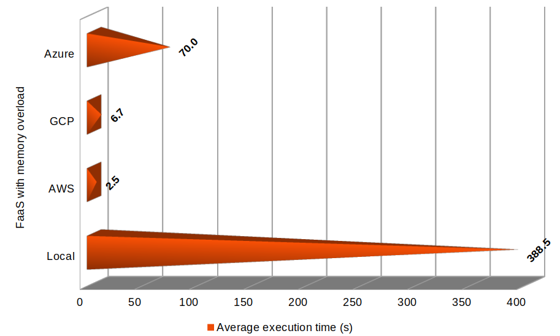

### Results of I/O Bound Test
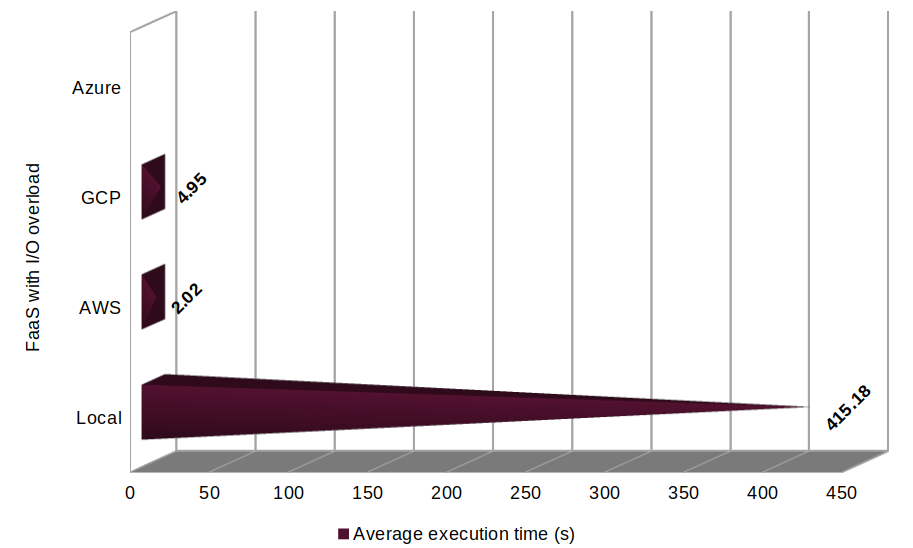

### Reliability rates
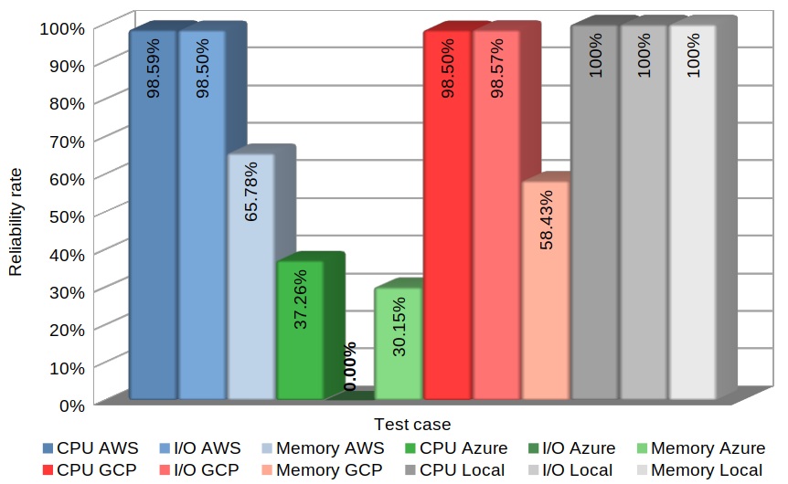

### Minimal and maximal execution time
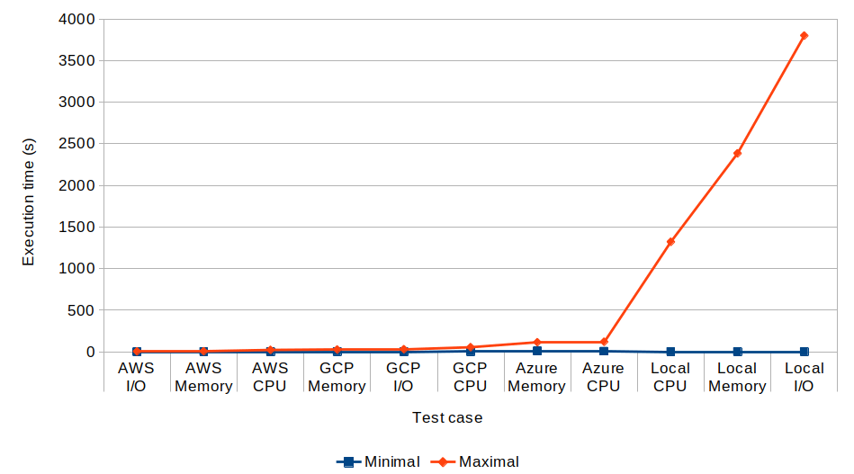


## Publications

 - 2019, May => CLOSER, Heraklion, Greece ([paper](https://www.scitepress.org/PublicationsDetail.aspx?ID=idUowDezrE8=&t=1))

 - 2020, May => CLOSER, Online Streaming ([paper](https://www.insticc.org/Primoris/Resources/PaperPdf.ashx?idPaper=93815))

 - 2020, Nov => CCGRID, Melbourne, Australia ([paper](https://ieeexplore.ieee.org/document/9139623))


## Support

If you need more information, send a message to: leouesb@gmail.com
